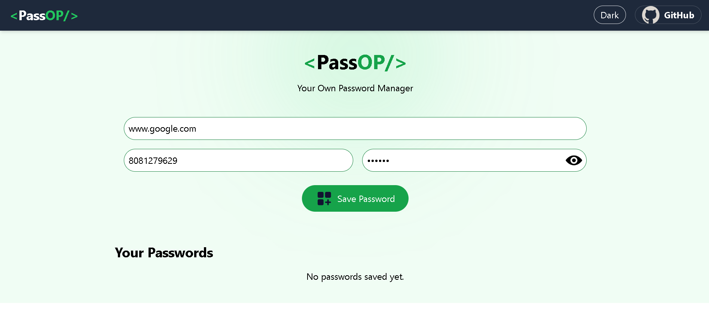
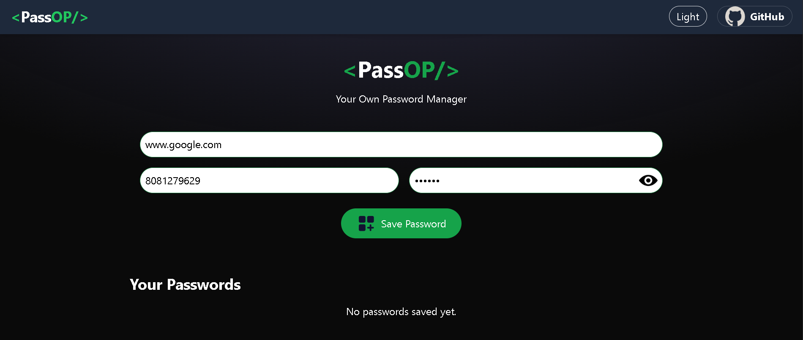
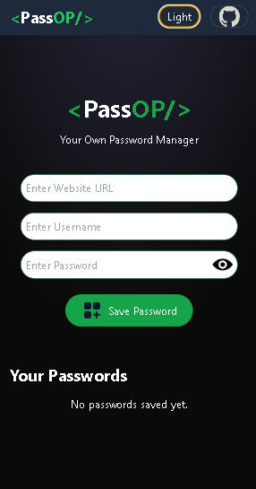

# 🔐 PassOP — Your Own Password Manager

PassOP is a simple and secure password manager built using React. It allows users to store, edit, and delete credentials locally in the browser with a clean UI and dark/light mode support.

---

## 🚀 Features

* Save website URL, username, and password
* Edit and delete saved credentials
* Copy credentials to clipboard
* Dark / Light mode toggle
* Data persistence using localStorage
* Responsive design for mobile and desktop
* Smooth UI with Lordicon animations

---

## 🛠️ Tech Stack

* React.js
* Tailwind CSS
* React Toastify
* UUID

---

## 📸 Preview

### ☀ Light Mode


### 🌙 Dark Mode


### 📱 Mobile View


---

## ⚙️ Installation

Clone the repository:

```bash
git clone https://github.com/Shubham123-k/passop.git
```

Navigate to the project:

```bash
cd passop
```

Install dependencies:

```bash
npm install
```

Run the app:

```bash
npm run dev
```

---

## 📂 Project Structure

```
src/
 ├── components/
 │   ├── Navbar.jsx
 │   ├── Manager.jsx
 │   └── Footer.jsx
 ├── App.jsx
 └── main.jsx
```

---

## 💡 How It Works

* All passwords are stored in the browser using `localStorage`
* Each entry is assigned a unique ID using UUID
* State is managed using React hooks
* Theme switching is handled globally via state

---

## ⚠️ Note

This project stores data in the browser and is intended for learning purposes. Do not use it to store sensitive or real passwords.

---

## 🔗 GitHub

👉 https://github.com/Shubham123-k

---

## 👨‍💻 Author

Shubham K

---

## ⭐ Support

If you like this project, consider giving it a star ⭐
